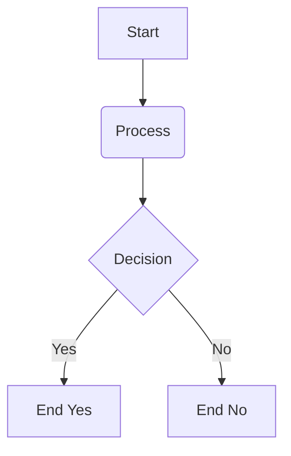

Hello, world. At some point, I felt the need to write things down. I have always enjoyed documentation, and recent events compelled me to find a voice, so to speak. The recent Elon beast mode everywhere, that sort of thing.

Some test

