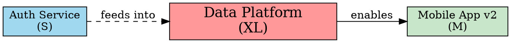

<style>
h1 { color: #1a365d; border-bottom: 3px solid #4299e1; padding-bottom: 0.3rem; }
h2 { color: #2b6cb0; border-bottom: 2px solid #bee3f8; padding-bottom: 0.3rem; }
h3 { color: #3182ce; border-left: 4px solid #90cdf4; padding-left: 0.8rem; }
.branch-nav { margin: 1rem 0; padding: 0.6rem 1rem; border-radius: 8px; font-size: 0.95em; }
.branch-nav a { text-decoration: none; font-weight: 500; }
.branch-nav a:hover { text-decoration: underline; }
.branch-nav.parent-link { background: linear-gradient(135deg, #fefcbf 0%, #faf089 100%); border-left: 4px solid #d69e2e; color: #744210; }
.branch-nav.parent-link a { color: #975a16; }
.branch-nav.child-link { background: linear-gradient(135deg, #c6f6d5 0%, #9ae6b4 100%); border-left: 4px solid #38a169; color: #22543d; }
.branch-nav.child-link a { color: #276749; }
.branch-inline { color: #2b6cb0; text-decoration: none; border-bottom: 1px dashed #90cdf4; font-weight: 500; }
.branch-inline:hover { color: #1a365d; border-bottom-style: solid; }
</style>

This transcript is generated by [parley.nvim](https://github.com/xianxu/parley.nvim).


<div class="branch-nav parent-link" markdown="0"><a href="">← Vision alignment tools</a></div>


## Question

 what is "Graphviz (DOT language)"? and which software supports it. 

I like both nice visualization but also the ability to generate it programmatically.

🤖:[Claude-Code-Opus]

🧠: The user is asking about Graphviz and its DOT language specifically. They want to know what it is and which software supports it. They also care about both visual appeal and programmatic generation. I should explain DOT language concisely, list key tools/renderers, and highlight the programmatic angle since that's their use case. They're technical (they're already using Mermaid), so I can be fairly direct.

Graphviz is a **graph visualization system** originally developed at AT&T Labs Research. The **DOT language** is its plain-text, declarative language for describing graphs (nodes, edges, attributes).

### How it works

You write a `.dot` file like this:



Key idea: **node/edge attributes** (`width`, `height`, `penwidth`, `fontsize`, `color`) let you encode size/complexity visually — which is exactly the dimension you said you're missing in Mermaid.

### Software that renders DOT

| Tool | Type | Programmatic? | Notes |
|---|---|---|---|
| **Graphviz CLI** (`dot`, `neato`, `fdp`) | Command-line | ✅ pipe `.dot` → SVG/PNG/PDF | The canonical renderer |
| **Python `graphviz`** lib | Python API | ✅ build graph in code, render | `pip install graphviz` |
| **D3-graphviz** | JS (browser) | ✅ render DOT in browser via WASM | Uses `@hpcc-js/wasm` under the hood |
| **Viz.js / @viz-js/viz** | JS library | ✅ pure JS/WASM Graphviz port | Works in Node or browser |
| **VS Code extension** ("Graphviz Preview") | Editor | ❌ manual | Live preview as you edit `.dot` |
| **Jupyter** (via `graphviz` Python lib) | Notebook | ✅ inline render | Great for exploration |
| **Confluence / Notion** | Wiki | ⚠️ embed SVG output | No native DOT support |

### Programmatic generation example (Python)

```python
from graphviz import Digraph

dot = Digraph('vision', format='svg')
dot.attr(rankdir='LR')
dot.attr('node', shape='box', style='filled')

# Items: (id, label, size_weight, color)
items = [
    ('auth',     'Auth Service',    1.2, '#a0d8ef'),
    ('data',     'Data Platform',   3.0, '#ff9999'),
    ('mobile',   'Mobile App v2',   1.8, '#c8e6c9'),
]

for id, label, w, color in items:
    dot.node(id, label=f"{label}\n(w={w})",
             width=str(w), fillcolor=color, fontsize=str(10 + int(w * 4)))

dot.edge('auth', 'data', label='feeds into', style='dashed')
dot.edge('data', 'mobile', label='enables')

dot.render('vision', view=True)  # outputs vision.svg and opens it
```

```bash
# To test from CLI directly:
pip install graphviz
python vision_graph.py

# Or raw DOT:
dot -Tsvg vision.dot -o vision.svg
```

### Graphviz vs Mermaid — key tradeoff

| | Mermaid | Graphviz |
|---|---|---|
| **Rendering** | Browser/Markdown native | CLI / lib, then embed |
| **Layout control** | Limited | Fine-grained (`width`, `pos`, subgraphs) |
| **Encode magnitude** | ❌ not really | ✅ node size, pen width, font size |
| **Programmatic** | Possible but awkward (string templating) | First-class (Python lib, JS lib) |
| **Looks pretty by default** | ✅ | ⚠️ Functional, not beautiful — needs styling |

### Practical suggestion

Since you're bridging business ↔ tech, a reasonable workflow:

1. **Source of truth**: a structured data file (YAML/JSON) listing initiatives, their size, type (biz/tech), dependencies
2. **Generate**: DOT graph programmatically from that data, encoding size as node width
3. **Render**: SVG → embed in your wiki/slides
4. **Iterate**: update the YAML, re-run, new graph

This keeps the representation **version-controlled and reproducible** — much better than manually dragging boxes in a whiteboard tool when the landscape keeps shifting.

📝: You asked what Graphviz/DOT language is and which tools support it, I answered with: it's a declarative graph description language from AT&T Labs, rendered by CLI tools and libraries (Python graphviz, D3-graphviz, Viz.js), with fine-grained node attributes (width, color, penwidth) that solve your "show size/complexity" need, and suggested a YAML→DOT→SVG pipeline for maintainability.

## Question

 you meant a yaml file to represent dot format?

🤖:[Claude-Code-Opus]

🧠: The user is asking for clarification. They're wondering if I meant YAML as an alternative representation of DOT format. No — I meant YAML as a higher-level, domain-specific data source (initiatives, their metadata like size, type, dependencies) that you then *transform* into DOT programmatically. The YAML is not representing DOT syntax; it's representing your business/technical domain model. The Python script reads the YAML and generates DOT. This is an important distinction — the YAML is your semantic layer, DOT is your visualization layer. Let me clarify this cleanly with a concrete example.

No — not YAML *as* DOT. I meant **two separate layers**:

```
YAML (your domain model)  →  Python script  →  DOT  →  SVG/PNG
     what things are             transform       layout    visual
```

The YAML captures **what you care about** in business/tech terms. The script *translates* it into DOT. This separation matters because:

- Non-technical people can read/edit YAML — they'll never touch DOT
- You can generate *multiple views* from the same YAML (e.g. a dependency graph, a timeline, a complexity heatmap)
- The YAML becomes your **single source of truth**, not the graph

### Concrete example

**`vision.yaml`** — your domain model:

```yaml
initiatives:
  - id: auth
    name: Auth Service Rewrite
    type: tech
    size: S
    quarter: Q3
    depends_on: []

  - id: data_platform
    name: Data Platform
    type: tech
    size: XL
    quarter: Q3-Q4
    depends_on: [auth]

  - id: self_serve
    name: Self-Serve Onboarding
    type: business
    size: L
    quarter: Q4
    depends_on: [data_platform, auth]

  - id: mobile_v2
    name: Mobile App v2
    type: business
    size: M
    quarter: Q1-next
    depends_on: [data_platform]
```

**`generate_graph.py`** — the transform:

```python
import yaml
from graphviz import Digraph

SIZE_MAP = {'S': 1.0, 'M': 1.5, 'L': 2.2, 'XL': 3.0}
COLOR_MAP = {'tech': '#a0d8ef', 'business': '#ffe0b2'}

with open('vision.yaml') as f:
    data = yaml.safe_load(f)

dot = Digraph('vision', format='svg')
dot.attr(rankdir='TB')
dot.attr('node', shape='box', style='filled,rounded')

for item in data['initiatives']:
    w = SIZE_MAP.get(item['size'], 1.5)
    color = COLOR_MAP.get(item['type'], '#eeeeee')
    label = f"{item['name']}\n[{item['size']}] {item['quarter']}"

    dot.node(item['id'], label=label,
             width=str(w), fillcolor=color,
             fontsize=str(10 + int(w * 3)))

    for dep in item.get('depends_on', []):
        dot.edge(dep, item['id'])

dot.render('vision_roadmap', view=True)
```

```bash
pip install graphviz pyyaml
python generate_graph.py
# opens vision_roadmap.svg
```

This produces a graph where:
- **Box size** = initiative complexity (S/M/L/XL)
- **Color** = business (orange) vs tech (blue)
- **Arrows** = dependencies
- **Labels** = timing

### Why this layering matters for your specific problem

You said you're the **bridge** between business and tech leaders. With this setup:

- The **YAML** is the artifact you co-author with both sides — it's readable, diffable, lives in git
- The **graph** is a generated output you show in meetings — nobody argues about box positions, they argue about the *data*
- When business says "we need self-serve in Q3", you update one line in YAML, re-run, and instantly see if the dependency chain supports that timeline

The graph is disposable. The YAML is the conversation.

📝: You asked to clarify whether I meant YAML as DOT format, I clarified it's two separate layers — YAML as a domain-specific source of truth (readable by both business and tech), with a Python script transforming it into DOT for visualization, keeping the semantic model separate from the rendering.

## Question

 ah, then I can also insert whatever links in the YAML etc. essentially develop a workbench around this, to manage dependencies.

I can for example imagine a [parley](https://github.com/xianxu/parley.nvim) like plugin to manage a folder in a repo. I can also see easily additional both read-only presentation of such folder on web, or eventually collaborative editing of this folder through web. 

Thoughts?

🤖:[Claude-Code-Opus]

🧠: The user is connecting dots — they see the YAML-as-source-of-truth pattern and are envisioning a full workbench around it. They reference their own neovim plugin (parley.nvim) which seems to be a tool they built. They're thinking about: 1) a repo folder as the backing store, 2) neovim plugin for power-user editing, 3) read-only web view, 4) eventually collaborative web editing. They're not really asking me a question — they're thinking out loud and want me to engage critically with the architecture. I should validate what's strong, flag risks/tradeoffs, and maybe suggest concrete architectural choices. I should not over-explain basics — this person clearly builds tools and thinks in systems.

Yes — you're describing a very natural architecture, and the key insight is right: **a folder of YAML files in a git repo is already a database** with versioning, diffing, branching, and access control built in.

### What you'd be building

```
repo/vision/
├── initiatives/
│   ├── auth-rewrite.yaml
│   ├── data-platform.yaml
│   └── self-serve-onboarding.yaml
├── schema.yaml          # optional: validate structure
└── views/
    └── roadmap.dot      # generated
```

Each initiative = one file. Dependencies reference other files by ID. This is essentially a **lightweight knowledge graph stored as flat files**.

### The three interfaces you're describing

| Interface | Audience | Mode |
|---|---|---|
| **Neovim (parley-like plugin)** | You, tech leads | Read/write, power user |
| **Static web view** | Stakeholders, all-hands | Read-only, generated |
| **Collaborative web editor** | Cross-functional leads | Read/write, structured |

This is a smart layering because you **decouple the data from the interface** — each layer is independently buildable and optional.

### What's strong about this

- **Git as the collaboration protocol** — you get PRs for vision changes, which is actually profound. "I propose we move self-serve to Q3" becomes a diff, not a meeting argument.
- **One file per initiative** scales better than one big YAML — fewer merge conflicts, easier to grep, natural unit of ownership.
- **Neovim-first** means you'll actually use it daily. Tools you don't live in die.

### Where I'd be cautious

**Don't build the web editor early.** The progression should be:

```
1. YAML files + generate script       ← start here, weeks of value
2. Neovim plugin for navigation        ← you'd build this naturally
3. Static site (read-only)             ← CI generates on push
4. Web editor                          ← only if non-git users need write access
```

Step 4 is where complexity explodes — you're building a CMS at that point (conflict resolution, auth, validation). Many teams never actually need it. A surprisingly effective middle ground: **non-technical people submit changes via PR templates** with a simple form, and you merge.

### For the static web view

A minimal approach that works well:

```python
# generate.py — run in CI on every push
# 1. Read all YAML files from initiatives/
# 2. Emit a dependency graph (SVG via Graphviz)
# 3. Emit an index.html with the graph + a table of all initiatives
#    each linking to a detail page or external docs
# 4. Deploy to GitHub Pages / S3
```

Each initiative YAML can carry a `docs_url` field pointing to a design doc, Notion page, whatever — the web view just renders it as a link. You don't need to centralize all documentation, just the **graph of relationships and sizing**.

### The real leverage

What you're building is not a project management tool. It's a **shared mental model with a rendering engine**. The value isn't the graph — it's that business and tech leaders can look at the *same structured data* and see their own concerns reflected:

- Business sees: what depends on what, what's blocking revenue
- Tech sees: what's complex, what's coupled, what's risky
- You stop being the translator and become the **maintainer of the schema**

That's a much more sustainable role than being the human bridge.

📝: You proposed building a workbench around YAML-in-git-repo with neovim plugin, static web view, and eventual collaborative editing; I validated the architecture, recommended one-file-per-initiative structure, cautioned against building the web editor too early (static site + PR workflow covers most needs), and reframed the value as shifting your role from human translator to schema maintainer.

## Question

 actually, parley already supports exporting a tree of markdown files (chat files) cross referenced. here, we replace markdown with yaml.

Assuming there's a company.yaml file of this "company vision" directory, we pretty much can generate easily various views, for example, two views:

1/ a dependency graph, the dot file and visualization mentioned above. 
2/ just plain web page with interlinked yaml files for navigation, parley style. 

We can add more different visualization easily, as likely any reasonable company.yaml is going to be too complex to just show fully, then maybe we only show starting from a node etc. We can customize whichever way. 

🤖:[Claude-Code-Opus]

🧠: Xian is refining the architecture and essentially validating his own thinking. He's not really asking a question — he's describing the design and implicitly asking for confirmation, refinement, or pushback. The key points he's making: 1) parley already has the tree-of-files + cross-reference pattern, 2) company.yaml as root, 3) multiple generated views from same data, 4) subgraph/filtered views because full graph is too complex. I should affirm what's strong, add any sharp insight, and push back where appropriate. The main thing I can add value on: the "too complex to show fully" problem is THE core UX challenge, and the "start from a node" idea is exactly right — this is essentially a graph traversal UI. I should also note that company.yaml as root is a good design choice (entry point / manifest). I should keep this concise since he's mostly thinking out loud and building momentum.

Exactly right. And the "start from a node" insight is the critical one — it's the difference between a tool that works in a presentation and one that works in a *conversation*.

### The architecture you're converging on

```
vision/
├── company.yaml              # root: top-level goals, references initiatives
├── initiatives/
│   ├── auth-rewrite.yaml     # references other initiative IDs
│   ├── data-platform.yaml
│   └── self-serve.yaml
└── generated/                # gitignored or CI-built
    ├── full-graph.svg
    ├── index.html            # interlinked browsable pages
    └── subgraphs/
        └── data-platform.svg # rooted at one node
```

`company.yaml` as the root is a good design choice — it's the **manifest**. It declares the top-level business objectives, and each one references initiatives. The graph is implicit in the `depends_on` fields across files. The views are just traversals.

### Two views, two purposes

| View | When you use it | What it answers |
|---|---|---|
| **Dependency graph** (rooted at node X) | Planning meetings, "why is this blocked?" | Structure, critical path, coupling |
| **Interlinked pages** (parley-style) | Async review, onboarding, reference | Detail, context, links to docs |

They complement each other well — the graph is for **seeing shape**, the pages are for **reading substance**.

### The "too complex" problem

This is actually the core UX problem of any vision-tracking tool, and "start from a node" solves it cleanly because it maps to how people actually ask questions:

- *"What does data platform depend on?"* → subgraph, ancestors
- *"What does data platform unlock?"* → subgraph, descendants
- *"What's on the critical path to self-serve?"* → shortest path from roots

These are all just **graph queries** over your YAML files. A small CLI like:

```bash
vision show data-platform --depth 2 --direction down
```

...would be more useful day-to-day than any full-graph rendering. And it's trivial to implement given you already have the traversal logic in parley for markdown trees.

### One thought

The parley pattern of "tree of cross-referenced files" is doing a lot of work here. What you're really building is **parley generalized beyond chat** — a structured-file graph with pluggable renderers. The chat files were the first content type. Vision YAML is the second. The rendering engine (interlinked HTML, graph viz, filtered subgraphs) is the reusable layer.

Whether you keep it inside parley or extract it as a sibling tool is a naming/packaging decision, but the core abstraction is the same.

📝: You described a company.yaml-rooted vision directory reusing parley's cross-referenced file pattern with multiple generated views, I affirmed the architecture and highlighted that "start from a node" graph traversal is the key UX insight, and that this is essentially parley generalized beyond chat into a structured-file graph with pluggable renderers.

## Question

 you can even run self consistency checks, or allocation of resources: did two person got assigned on the same project etc. really can embed any rules. 

What's your take on the value of such software in a business? would it help align business leader and tech leader? based on my experience with parley, this is easily constructable, maybe 1 week of my time I think. 

thoughts?

🤖:[Claude-Code-Opus]

🧠: Xian is asking me to evaluate the business value of this tool concept — whether it would actually help align business and tech leaders. He's also sanity-checking the 1-week estimate. He has deep experience building parley, so he knows his velocity. I should be honest and critical here, not just cheerleading. Let me think about what actually drives alignment in organizations vs. what tools can do. The real question is: does the problem of business/tech misalignment stem from lack of shared artifacts, or from deeper organizational/incentive issues? A tool helps with the former but not the latter. I should also consider: does this already exist? (Roadmapping tools like Productboard, Jira, etc.) What's different here? The key differentiator is the code-native, git-native, programmable nature. Let me be balanced.

The honest answer: **the tool itself has moderate value; the process of building and maintaining it together has high value.**

### Why I'm cautious about the tool alone

The alignment problem between business and tech leaders is rarely about lack of visibility. It's usually about:

- **Different incentive horizons** — business optimizes for next quarter's revenue, tech optimizes for next year's maintainability
- **Different risk models** — business sees delay risk, tech sees complexity risk
- **Lack of shared vocabulary** — not lack of shared documents

A beautifully rendered dependency graph doesn't fix any of these. I've seen teams with Jira boards, Productboard roadmaps, Notion wikis, all perfectly structured — and still fundamentally misaligned because the leaders don't actually negotiate tradeoffs together.

### Where it *does* help

The specific thing your tool does that existing roadmap tools don't:

1. **Makes dependencies non-negotiable.** When a business leader says "move self-serve to Q3," the graph mechanically shows what that requires. It shifts the conversation from opinion to constraint propagation. This is genuinely powerful.

2. **Consistency checks as guardrails.** The rules engine you described — resource conflicts, impossible timelines, circular dependencies — turns implicit disagreements into explicit violations. That's a forcing function for alignment.

3. **Git-native means decisions have history.** "Why did we deprioritize X?" becomes `git log initiatives/x.yaml`. No other roadmap tool gives you that for free.

4. **It's yours.** You can shape it to your org's actual decision-making process, not Jira's abstraction of what a process should be.

### The real value proposition

The highest-leverage use isn't the software — it's **the weekly ritual of reviewing it together**. If you get the business leader and tech leader to co-edit `company.yaml` in a meeting, even briefly, the act of negotiating what goes in the file *is* the alignment. The tool is the excuse.

This is the same dynamic that makes architecture decision records (ADRs) work — the document isn't the value, the conversation that produces the document is.

### On the 1-week estimate

Believable for you, given parley's existing infrastructure. But scope it tightly:

- Week 1: YAML schema + CLI to generate graph + static HTML. **Stop here and use it for 2-3 weeks.**
- Only then decide if you need more.

The risk isn't build time — it's **over-building before you've validated that other people will actually look at the output**. You'll use it because you built it. The question is whether the business leader opens the link.

### Bottom line

It's worth the week. But go in with clear eyes: you're building a **conversation scaffold**, not a solution to misalignment. The tool works if it becomes a shared artifact that both sides feel ownership over. It fails if it becomes "Xian's graph that he shows in meetings" — at that point you're still the translator, just with a nicer visual aid.

📝: You asked whether this YAML-based vision tool would actually help align business and tech leaders and whether the 1-week build is worth it, I answered that the tool has moderate standalone value but high value as a conversation scaffold — the real alignment comes from co-editing the shared artifact together, not from the visualization itself, and cautioned against over-building before validating that others engage with it.

## Question

 Yep, the real value is to have a tool that we own, and can tweak to whatever abstraction and workflow we need, with minimal learning curve, so to speak. and yes, having the same vocabulary is one core reason to have such a thing to begin with.

to further flesh out the idea, everything can be in a single yaml file, the directories and files are merely creating scoped namespaces for "project names"

And to KTS (keep things simple), we don't need an ID, if an "ID" is needed for project, it's just snake case of the project name.

```
- name: Auth Service Rewrite
  type: tech
  size: S
  quarter: Q3
  depends_on: []

- name: Data Platform
  type: tech
  size: XL
  quarter: Q3-Q4
  depends_on: [auth]

- name: Self-Serve Onboarding
  type: business
  size: L
  quarter: Q4
  depends_on: [data_platform, auth]

- name: Mobile App v2
  type: business
  size: M
  quarter: Q1-next
  depends_on: [data_platform]
```

We can even support prefix-ID scheme, e.g. you can write `data` to refer to `data platform`, basically all IDs are going to be prefix matched. If there are multiple match, or zero match, we would throw an error, as user to correct it. The whole thing is to get out of the way. All the fields are strings, until we assign strong semantic or syntax in code. All can be incrementally evolved, e.g. compiler will tell you error, if some syntax/semantic is tightened. 

we can also support type-ahead in nvim, when input in the depends_on list. need to resist over engineering for now. I think the key first step is to have structure up, and a reasonable export, to a spreadsheet, so that TPM can use to organize things. 

🤖:[Claude-Code-Opus]

🧠: Xian is refining the design and I should engage critically with the specific design decisions. Key observations: 1) prefix-matching IDs from snake_cased names is clever but has a known trap, 2) the spreadsheet export insight is very practical — that's how TPMs actually work, 3) he's showing good discipline about resisting over-engineering. I should affirm what's sharp, flag the one real risk in prefix matching, and keep it concise since he's in flow.

Yes — this is clean. A few reactions:

### Prefix matching is the right UX, with one guardrail

The scheme works well *now* with a small number of initiatives. The failure mode is: you add "Data Lake" later, and suddenly `data` is ambiguous where it wasn't before. Your "multiple match → error" rule handles this correctly — but the **error surfaces at read time**, meaning someone's previously-valid file breaks when a *different* file introduces a new initiative.

Not a reason to avoid it. Just worth noting that when it happens, the fix is trivial (lengthen the prefix). And the error message should say clearly: `"data" matches both "data_platform" and "data_lake" — be more specific`.

### Spreadsheet export is the killer first output

This is the right call. Not the graph — the **CSV/spreadsheet**. Because:

- TPMs live in spreadsheets. That's their IDE.
- A spreadsheet with `name | type | size | quarter | depends_on` is immediately useful for status tracking, resource planning, sorting, filtering — all the things TPMs do that you don't want to build UI for.
- The TPM will *add columns* (status, owner, notes) — that's fine, the YAML is the structural source of truth, the spreadsheet is the working copy.

The graph is for you and leadership. The spreadsheet is for the people who actually run the projects.

### What I'd build in the first sitting

```
company.yaml  →  Python script  →  spreadsheet.csv
                                →  roadmap.svg (graphviz)
                                →  errors.txt (validation)
```

Three outputs, one command. The validation pass (dangling refs, ambiguous prefixes, circular deps) is arguably more valuable than either of the other two, because it catches the "wait, that doesn't make sense" moments before the meeting instead of during it.

### On "all fields are strings"

This is the right starting posture. The moment you introduce enums or date parsing, you're making schema decisions that constrain how people express things. Let `quarter: "Q3-Q4"` and `quarter: "late Q3"` both be valid until you have a reason to parse them. The compiler-tightening-over-time metaphor is exactly right.

You're designing a tool that **earns its strictness** rather than imposing it upfront. That's why people will actually use it.

📝: You asked about refining the YAML schema design (prefix IDs, string-typed fields, spreadsheet export), I answered affirming prefix-match with ambiguity guardrail, that CSV export for TPMs is the killer first feature over the graph, and that "all strings until proven otherwise" is the right schema evolution strategy.

## Question


